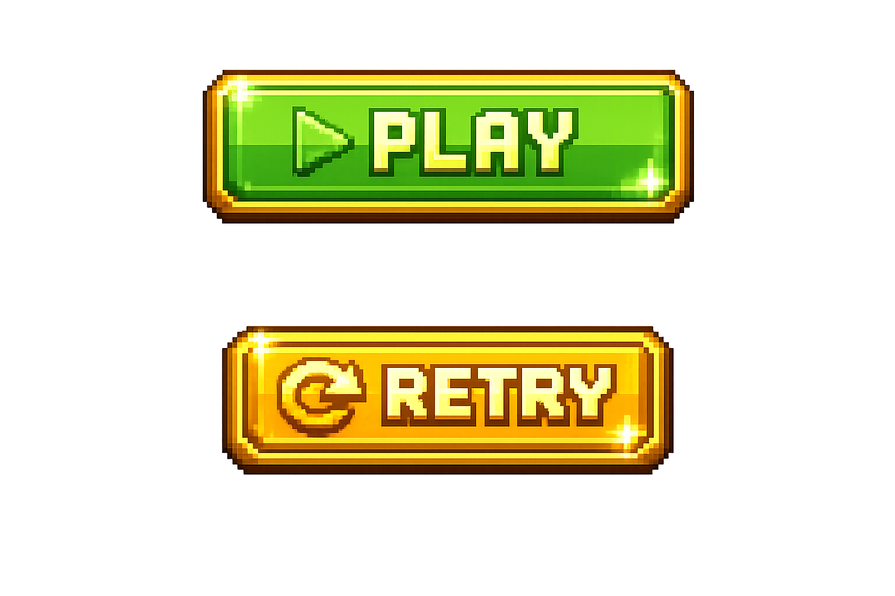
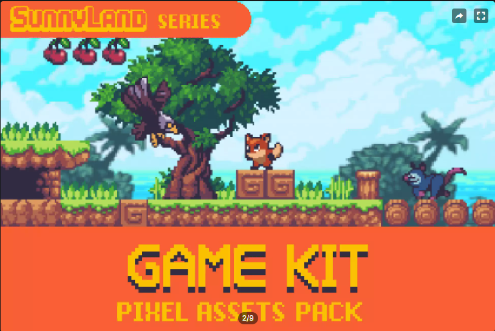
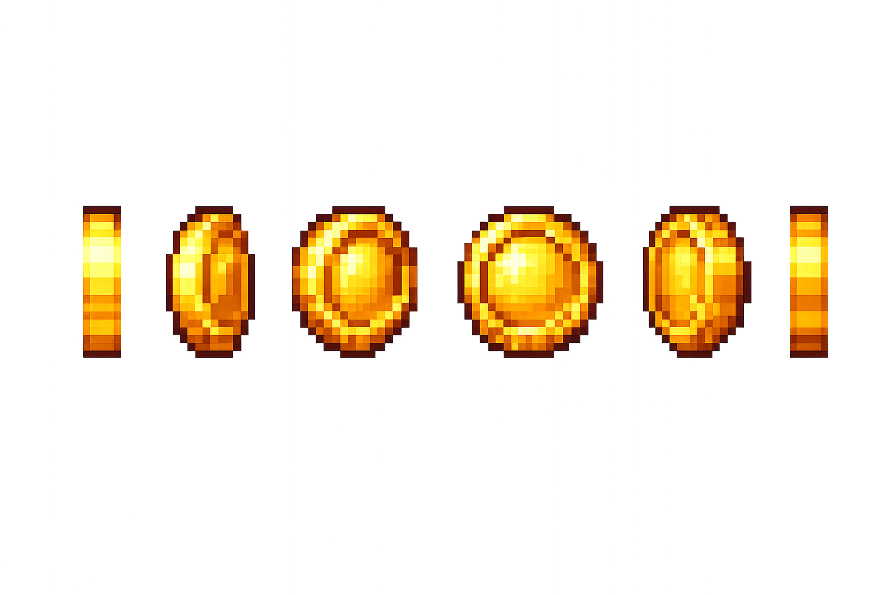
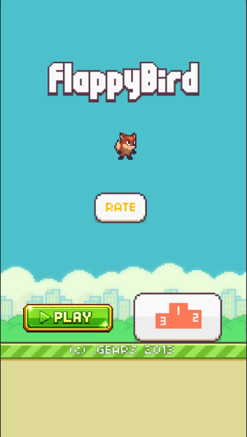

# Unity Bird – Reskin & Gameplay Modification Test

This project is a modified version of **UnityBird**, a simple Flappy-Bird–style mobile game built with Unity.

The goal of this task is to demonstrate the ability to **reskin assets**, **modify UI**, and **implement a small gameplay change** within a limited time frame, while keeping the project clean and functional.

---

## 🔗 Original Project

- Original Repository:  
  https://github.com/crosslife/UnityBird

---

## 🛠️ Summary of Changes

### 1. UI Change ✅
- Replaced the **main menu Play button UI**
- Added a **Retry button** that appears when the player dies
- Updated layout and visual style while keeping button functionality intact

### 2. Asset Change ✅
- Replaced the original bird sprite with a **Fox character**
- Asset source:  
  https://assetstore.unity.com/packages/2d/characters/sunny-land-103349
  
- Ensured:
  - Proper scaling
  - Correct animation playback
  - No impact on gameplay behavior

### 3. Gameplay Change ✅
- Added a **collectable coin**
- Coin:
  - Appears during gameplay
  - Can be collected by the player
  - Plays a sound effect on collection
- This provides a clear, testable interaction added to the original gameplay loop

---

## 🎮 Gameplay Overview

- Player controls a fox character instead of a bird
- Avoid obstacles as in the original UnityBird
- Collect coins for feedback and interaction
- On death:
  - Game over UI appears
  - Retry button allows restarting the level instantly

---

## 📸 Screenshots

---
